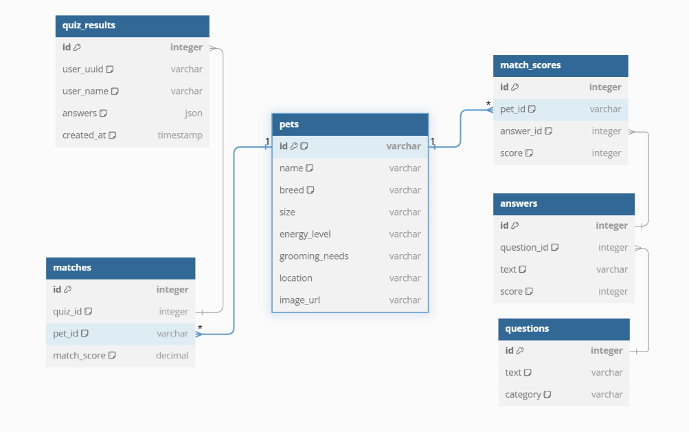
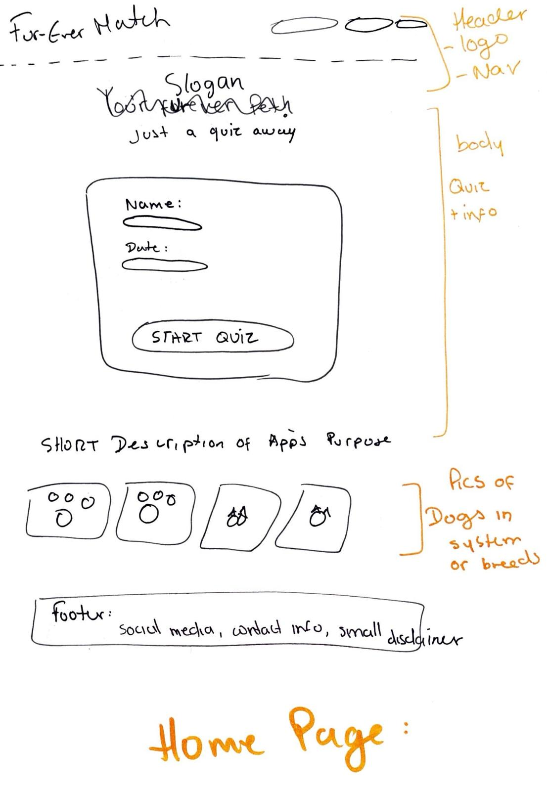
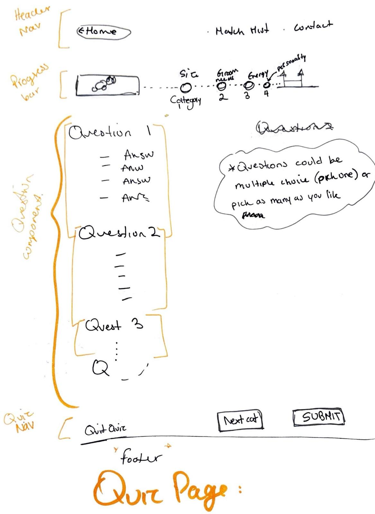
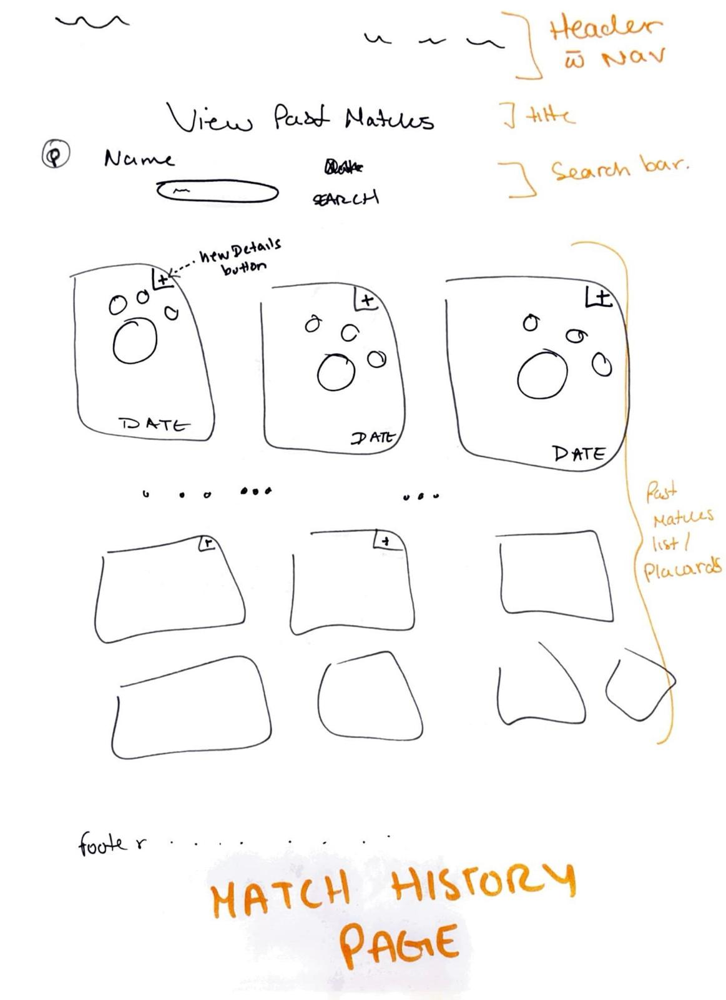
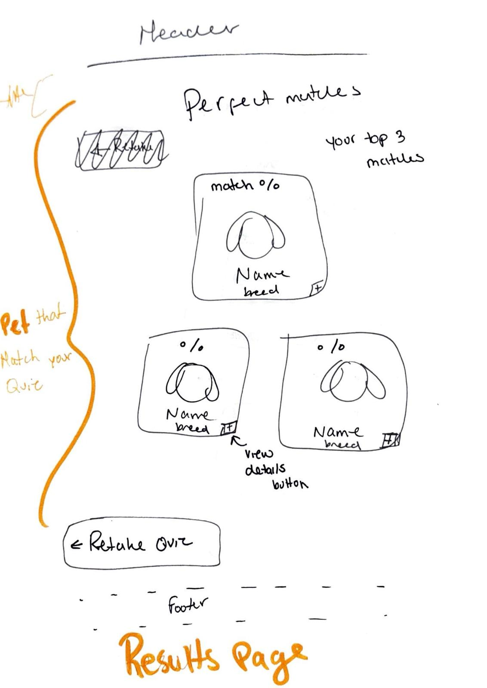
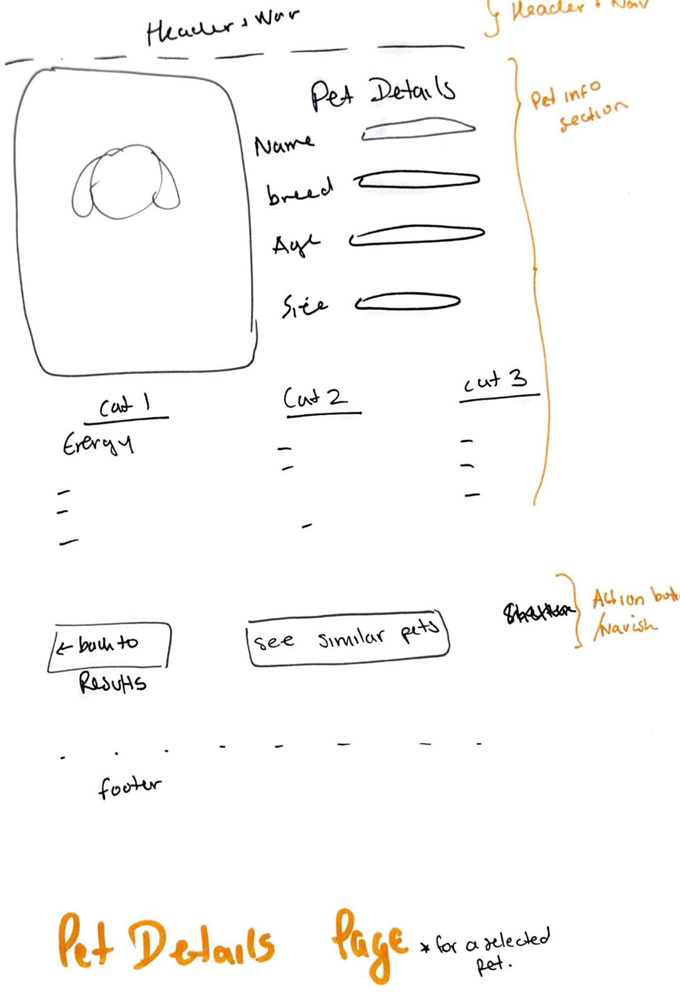
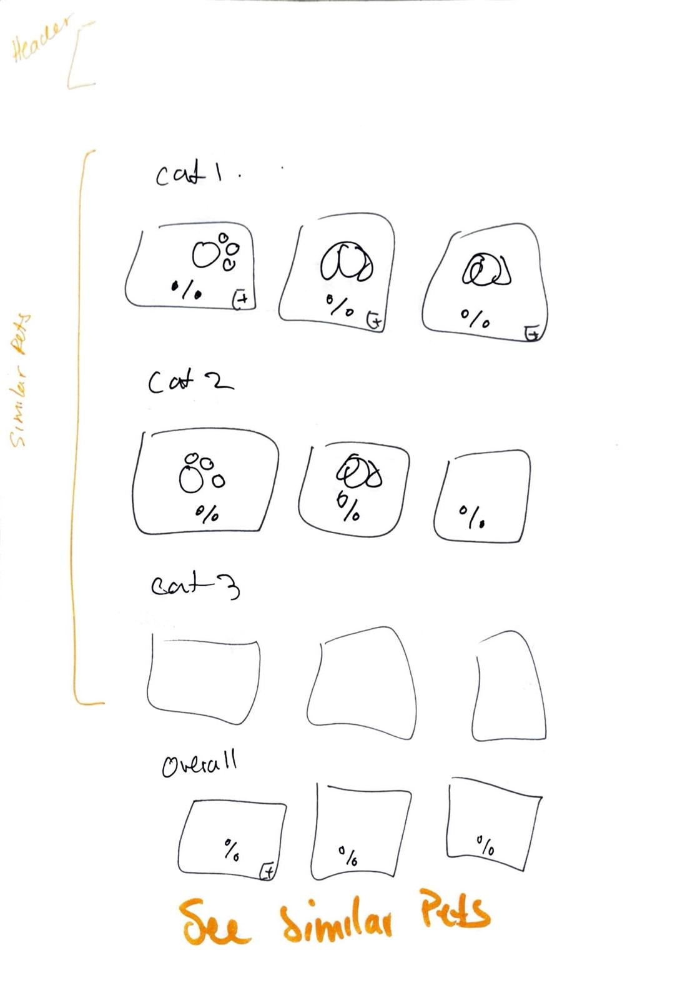

# Project Title

Fur-Ever Match!

## Overview

Pet Match is a full-stack web application designed to help users find their ideal pet by pairing them with adoptable pets based on their preferences. The app utilizes two APIs: one for breed types and another for pets in need of adoption. The matching process is facilitated through a a structured quiz that considers grooming needs, lifestyle compatibility, and activity level.

### Problem Space

Many individuals struggle to find a pet that matches their lifestyle, especially regarding grooming needs, energy levels and daily care requirements. As a result, some pets are returner to shelters due to mismathces. This application aims to bridge this gap by providing an intelligent, data-driven pet-matching system that prioritizes both the adopter's needs and the pet well-being.

### User Profile

Fur-Ever Match is geared toward pet grooming salons, helping potential adopters make informed choices about dogs that match their time commitment, care capabilities, and lifestyle needs. The application can also be valuable for:
-Potential Pet Owners → Those looking for the right dog match.
-Animal Shelters & Rescuers → To increase adoption success rates.
-Pet Enthusiasts → To learn about different breeds and responsible ownership.

### Features

Some of the feautures i would like to integrate are:
The user questionnaire/quiz: Users answer a quiz to determine their ideal pet match.
The pet matching algorithm: Compares quiz results with available pets and suggests the best matches.
Pet listings: Displays information about recommended pets, including breed, shelter location, and adoption details.
pet details page: displays in depth info and dog details
match History: Saves previous matches, users can enter their name to retrieve past quiz results and view their matched pets
see similar pets page: only accessile once quiz is completed

## Implementation

### Tech Stack

The front end will use: react, avios, sass. WHile the backend will use node.js, express, axios, mysql.

### APIs

This project will use 2 api. The Open Dog Registry Api, that provides all breed information inlcuding name of breed, weight, hairlenght, personalitites, and some more. The Petfinder API, will be used to provide real-time data on adoptable pets form shelters.

### Sitemap

So far the sitemap is very simple, in the early stages. I want 6 Pages:
-The Home Page: description of app, and purpose/drive behind the app
-Quiz Page: where users interact via quiz to gain information on the type of dog to best fit their time, their energy, their attention, and their lifestyles
-Results Page : displays best type of dog. and then best pet matches
-Pet Details Page: more indepth information about the breed and about the dog itself!
-match history

Below is the database schema (sitemap) for **Version 1**:

### Mockups

mokups and sitemap in images folder!!!
Provide visuals of your app's screens. You can use pictures of hand-drawn sketches, or wireframing tools like Figma. see pictures.
Below are the wireframes for **Version 1**:

Below are the wireframes for **Version 1**:

Home Page

Quiz Page

Results Page

Pet Details Page

Match History Page

See Similar Pets Section (Inside Pet Details Page)

### Data

Users: uuid based mathcing, no authentication

quiz results:stores quiz responses.

Breeds: Contains breed details retrieved from the Open Dog API.

Pets: Stores available pets fetched from the Petfinder API.

Matches: Keeps track of user-pet match history.

### Endpoints (STILL DECIDING ON THIS)

List endpoints that your server will implement, including HTTP methods, parameters, and example responses.
POST /register - Registers a new user.
POST:

- /quiz - Processes user responses and determines best matchesSSS.

GET

- /breeds - Fetches breed data from Open Dog API.
- /pets - Retrieves adoptable pets from Petfinder API.
- /matches/:userName - Fetches past matches for a name.

DIVING DEEPER:
POST:

- /contact/:petId - Sends an adoption inquiry to the respective shelter.

## Roadmap

Scope your project as a sprint. Break down the tasks that will need to be completed and map out timeframes for implementation working back from the capstone due date.
I decided to try and get most done in two weeks with extra dayd can be taken in between or to overestimate how long each component will take.

Week 1 - Planning & Setup:
Day 1-3: Finalize project scope and feature set, set up GitHub repository, and initialize the project.
Day 4-5: Establish database schema, create necessary tables in MySQL, and connect backend to the database.
Day 6-7: Implement the quiz page UI and the matching algorithm.

Week 2 - Development & Testing:
Day 8-10: Integrate Open Dog API & Petfinder API, build the results page, and connect pet matching.
Day 11-13: Develop the Pet Details Page with 'See Similar Pets' functionality and the Match History Page.
Day 14: Conduct final testing, fix bugs, and deploy the application.

---

## Future Implementations

Version 2 & Future Implementations

Diving Deeper: Version 2 Features

User Authentication → Users create accounts to save quiz results permanently.
Saved Matches for Logged-In Users → Instead of using name-based lookup, users can save and revisit matches.
User Profile Page → Stores past quizzes and pet preferences.
Favorites List → Users can bookmark pets for later.
Shelter Contact Integration → Allows users to send adoption inquiries directly.
Advanced Filtering → Users can filter matches based on additional criteria (e.g., hypoallergenic, family-friendly, etc.).

Version 2 - API Endpoints
New Endpoints for Authentication & User Profiles:
POST /register → Registers a new user.
POST /login → Authenticates an existing user.
GET /users/:id → Retrieves user profile information.
POST /contact/:petId → Sends an adoption inquiry to the respective shelter.
